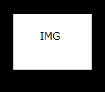

# Markdown記法

----
## Hタグ

## これはH2タグです
### これはH3タグです
#### これはH4タグです

----
## fontスタイルなど

_イタリック_
__太文字__ 

*イタリック*
**太文字**

~~打ち消し~~

`code`のように記述できる

----
## codeの書き方

スペースを4つ開ける

    sudo -s
    cp -p hoge1 hoge2

バッククオート3つ付ける

```bash
sudo -s
```


## Link

[リンクの書き方](http://yahoo.co.jp)


## 画像を貼り付ける

通常の画像



rightboxを使った画像

img[./test.png]

## HTMLタグが利用可能

<center>center</center>
